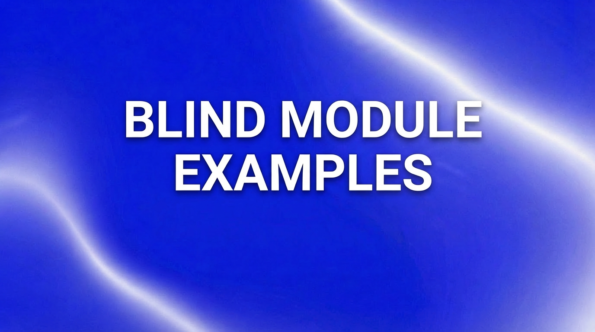

# Blind Module Examples

Current modules and examples available in this repository.

## nilDB (`/nildb`)

Private Storage / nilDB examples:

- [secretvaults-ts](/nildb/secretvaults-ts)
  - [owned-collection](/nildb/secretvaults-ts/owned-collection) (TODO)
  - [standard-collection](/nildb/secretvaults-ts/standard-collection)
    - [nextjs-app-metamask-full](/nildb/secretvaults-ts/standard-collection/nextjs-app-metamask-full) (full Next.js + MetaMask example)
    - [nextjs-app-full](/nildb/secretvaults-ts/standard-collection/nextjs-app-full) (directory currently empty)
- [secretvaults-py](/nildb/secretvaults-py) (README links to examples in the external `secretvaults-py` repo)

## nilAI (`/nilai`)

Private AI / SecretLLM examples:

- [secretllm_nextjs](/nilai/secretllm_nextjs) (Next.js chat app with API-key flow)
- [secretllm_nextjs_nucs](/nilai/secretllm_nextjs_nucs) (Next.js chat app with API-key and delegation flows)
- [secretllm_nodejs](/nilai/secretllm_nodejs) (Node.js script example)
- [secretllm_python_nucs](/nilai/secretllm_python_nucs) (Python script examples)

## nilCC (`/nilcc`)

Compute examples:

- [nilcc-x402-api](/nilcc/nilcc-x402-api) (Express REST API with x402 payments and Docker compose)
